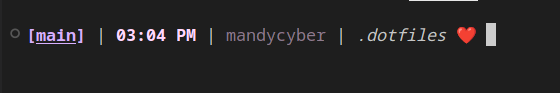
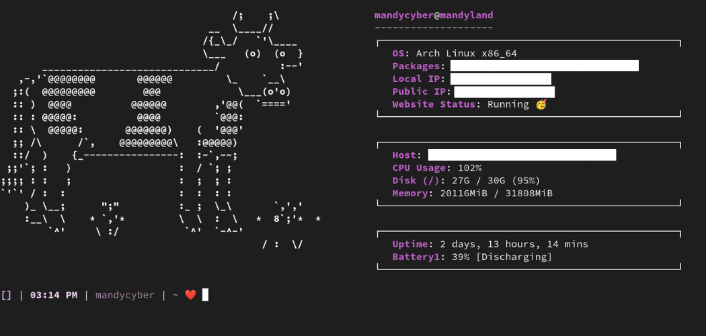

# dotfiles
> Managed with [GNU Stow](https://www.gnu.org/software/stow/)

<!-- START OF MDTOC -->
### Table of Contents
- [:wrench: Installation](#wrench-installation)
- [:file_folder: Sections](#filefolder-sections)
    - [:robot: bash](#robot-bash)
    - [:monkey: git](#monkey-git)
    - [:cow: neofetch](#cow-neofetch)
    - [:computer: nvim](#computer-nvim)
    - [:snake: scripts](#snake-scripts)
    - [:busts_in_silhouette: ssh](#bustsinsilhouette-ssh)
    - [:star2: vscode](#star2-vscode)
- [:wave: See ya](#wave-see-ya)

<!-- END OF MDTOC -->

# :wrench: Installation

**1. Clone this repository into your home directory**
```bash
# go to your home directory
cd ~
```
```bash
# clone the repository
git clone https://github.com/Mandy-cyber/dotfiles.git
```

**2. Rename the `dotfiles` directory to `.dotfiles`**
```bash
mv dotfiles .dotfiles
```

**3. Install GNU Stow**
```bash
# google for other platforms LOL <3
pacman -Syu stow        # Arch
brew install stow       # MacOS
```

**4. Install the dotfiles**
```bash
# go to the dotfiles directory
cd ~/.dotfiles
```
```bash
# stow each package
stow bash
stow git
stow neofetch
stow nvim
stow scripts
stow ssh
stow vscode
```

**5. Customize**

Okay so *maybe* this step should've come before `Step 4` but alas here we are! 

This step is where it gets :sparkles:fun:sparkles:. Just open up the files in the different `.dotfiles` directories and customize them to your liking! If you're new to managing dotfiles and are truly lost then check out [this article](https://dev.to/jogendra/intro-to-dotfiles-4bb8) or [reach out to me](https://github.com/Mandy-cyber)!


# :file_folder: Sections
> Breaking down the different parts of the dotfiles

## :robot: bash

### .bash_aliases
Think of aliases as **shortcuts for commands**.  They are especially useful for commands that you use frequently, complex commands that are hard to remember, or commands that you don't want to type out every time.

This file contains all of the aliases I love to use **e.g.**
```bash
# copy the result to my clipboard
alias clip='xclip -selection clipboard'

# rename a git branch locally and remotely
alias git-rename='git checkout $1 && git branch -m $2 && git push origin -u $2 && git push origin --delete $1'

# open minecraft (i can never remember where it's downloaded haha)
alias minecraft='$HOME/Desktop/Games/minecraft-launcher'
```

### .bash_logout
I don't currently have anything setup here, but the `.bash_logout` file is run when you log out of your terminal!

### .bash_profile
This file is run when you log in to your terminal. It's a good place to put commands that you want to run every time you log in.

For me, I only have it do `source ~/.bashrc` so that my `.bashrc` file is loaded every time I log in. You could also put other commands in here if you wanted to!

### .bashrc
Okay so this is really just an extension of the `.bash_profile` file (at least for how I'm using it)! I have a section that handles commands I want to run **when a new terminal is opened**, I have a section for **customizing my command prompt**, and I have a section for **setting up environment variables**.

The most fun is *definitely* customizing your command prompt. Mine looks like this:



You can generate your own using [this](https://bash-prompt-generator.org/) really useful online tool!

## :monkey: git

### .gitconfig
Have you ever gotten those annoying terminal messages when you're e.g. just pushing a branch to remote for the first time and it's like `"run this command first OR configure your git settings"`? Yeah so the `.gitconfig` file is where you configure those settings!

You can get *really* detailed with them if you want, but my use cases are pretty simple:
```python
[user]
	mail =                          # setup your email address
	name = Mandy-cyber (Laptop)     # setup the name of your user
	email =                         # same as mail
[pull]
	rebase = false                  # don't rebase when pulling
[push]
	autoSetupRemote = true          # automatically set up remote when pushing
[core]
	editor = nvim                   # set your default editor to neovim
	excludesFile = ~/.gitignore     # set your default/global .gitignore file
[init]
	defaultBranch = main            # set the default branch name to main
``` 

## :cow: neofetch
I am admittedly still a `neofetch` noob... If you reach out to me re this, prepare for disappointment:sparkling_heart:! All I can tell you is that it's a really cool tool that displays your system information in a fun and customizable way! I have it setup to run whenever a new terminal is opened.

This is what mine looks like:



So cute right! I have the ascii art being loaded in from `ascii-art.txt` so make changes to that file to add your own!

## :computer: nvim
As of `November 5th 2024` I am very sleepy, so have yet to update this section! For now you can refer to the README i wrote [here](https://github.com/Mandy-cyber/nvim-setup). Most of the information is the same, but I'll get around to updating it before the year ends (**maybe**) :heart:!

## :snake: scripts
These files are just scripts that I use to automate some of my tasks. I have a few scripts that I use to **start my VPN**, a script that I use to **move my most recent screenshot to a folder**, and a script that I use to **generate a table of contents for my markdown files**.

Feel free to keep these scripts and customize them to your liking! The `mdtoc` script actually comes from my repo [here](https://github.com/Mandy-cyber/Markdown-ToC-Generator/) if you want to check it out or contribue:sunglasses:.

## :busts_in_silhouette: ssh

### config
This is a very basic file which is more to show you how to use it, as opposed to what my actual setup is *(y'all don't need all of my info like that!)*. Here's a breakdown of what the block means:

```bash
Host github                 # defines an alias for github connections
    Hostname github.com     # defines the hostname
    User git                # defines the user to log in as 
    IdentityFile ~/.ssh/id_github # defines the key to use for authentication
```

## :star2: vscode
All of these files are just used by vscode to determine the extensions I like, some keymappings I use frequently, common settings, etc!

You'll probably end up completely overriding what I have and using your own files!

# :wave: See ya
Happy coding :heart:
<br>
-Mandy